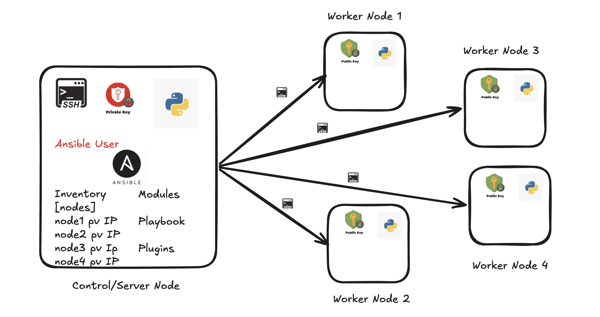

# DevOps standard tools concepts and implementations

## Configuration Management

* *Configuration Management (CM)* is an IT process that ensures all software and hardware systems maintain a consistent desired state. It automates the setup, maintenance, and tracking of servers and infrastructure, eliminating manual errors and configuration drifts.

* To be more detailed, an egineering process for establishing and maintaining consistency of product's performance, functional, and physical attributes with its requirements design and operational information throughtout its life.

* Types of Configuration Management
    * Configuration Management tools generally falls into two main operational categories based on how they apply updates:

    - Push Based Configuration Management
        * Master server pushes configuration directly to target nodes.
        * Target system do not need to pull updates.
        * Requires `SSH` or `WinRM` access to targets.
        * Example: **Ansible**.
            - **[Ansible](https://ansible.com):**
                * Architecture: Agentless.
                * Language: YAML.
                * Control: Push-based over `SSH`.
    
    - Pull Based Configuration Management
        * Agents installed on target nodes periodically check a master server.
        * Agents pull down the latest configuration if changes occur.
        * More scalable for massive environments.
        * Example: **Puppet, Chef**.
            - **[Puppet](https://puppet.com):**
                * Architecture: Agent-master.
                * Language: Puppet DSL (Domain Specific Language).
                * Control: Pull-based.
            - **[Chef](https://chef.io):**
                * Architecture: Angent-master.
                * Language: Rubby-based DSL.
                * Control: Pull-based.
            - **[SaltStack](https://saltproject.io):**
                * Architecture: Master-minion (can be agentless).
                * Language: Phython/YAML
                * Control: Speed focused push/pull via ZeroMQ.

### Ansible           

* Ansible is a open-source automation platform sponsored by Red Hat. It is highly popular due to its low barrier to entry and simple architecture.

* **Key Characteristics** 
    - **Agentless**: No software needs to be installed on target nodes.
    - **Idempotent**: Running a script multiple times yields excat same result without repeating completed tasks.
    - **Declarative/Procedural Hybrid**: You define the desired state, Ansible figures out how to achieve it.

* **Use Cases**
    - **Configuration Management**: Istall/Update package manager, manage files and services
        * Debian -> Ubuntu, debian, .. etc (`apt` package manager).
        * Redhat -> CentOS, redhat linux, amazon linux, ..etc (`yum` or `dnf`).
        * Windwos -> `choco` or `winget`.
    - **Application Deployment**: Deploys application code in multiple server.
        * Example: Deploys artifacts to tomcat webserver.
    - **Orchestration**: Ansible handles orchestration by executing automated steps in a strict, step by step order accross multiple servers form a single central machine.
        * Example: Setting up kubernetes cluster.
    - **Provisioning**: Creates resources in any cloud (AWS/Azure/GCP).

* **Core Concepts**    
    - **Control Node**: The machine where Ansible is installed and executed from.
    - **Managed/Worker Nodes**: The target servers managed by the control node.
    - **inventory**: A file (hosts) listing the IP addresses/domains of managed nodes.
    - **Modules**: Small plugins that execute specific tasks (e.g., installing a package, copying a file).
    - **Playbooks**: `YAML` file where automation tasks are defined and ordered.
    - **Ad-hoc**: Adhoc command is a single, quick task run directly from your terminal using the `ansible` command. It is used to perform immediate actions, like. checking server disk space or restarting a service-without writing a formal automation script (playbook).
        Example: `ansible all -m ping` used to check if servers are reachable.

* **Ansible Architecture**:
    
    - *Note*: 
        * We need to create users and provide sudo permissions both on ansible server as well as on worker nodes.
        * Their is a file called `known_hosts` which lies inside `.ssh` directory, it is a local database that stores the unique public keys (host keys) of all remote servers you have previously connected via `ssh`.

* **Core Requirements**
    - **Control Node**: A system running Linux, MacOS, or WSL (Windows subsystem for Linux) with *python 3.9* or newer installed.
    - **Ansible Package**: Installed on the control node, typically via `pip` (Python's package installer) or your OS's package manager.
    - **Target Nodes**: The remote server or devices you want to change. They only require: 
        * A running `SSH` server.
        * A user account with permissions to execute commands (and often sudo privileges of system-level changes)
        * Python3 installed (to run complex modules).
    - **Target accessibility**: The control node must be able to resolve the hostnames and IP addresses of the target node and reach them over the network (usually via port22).

#### Ansible Environment Setup (AWS)

##### Using 3 ubuntu instances (`ubuntu-ansible-server`, `ubuntu-worker-1`, `ubuntu-worker-2`)

###### **Create Ansible Server**: 
  * sign in to  the AWS Management Console.
  * Go to **EC2 Dashboard** and click Launch Instance.
  * Enter the instance name as `ubuntu-ansible-server`.
  * Select Ubuntu as operating system.
  * Choosen the required instance type (auto-selected free-tier).

###### **Configure the Key Pair**:
  * Select an exisiting key pair or create a new one.
  * A key pair is used to securely connect to your EC2 instance using `SSH`.

###### **Configure Network Settings**:
  * if you want the instance to be in a specific environment, choose the required **VPC**. Otherwise, use the default VPC.
  * Select an existing security group or create a new one.
  * Allow SSH (port 22) so you can connect to the instance.
  * if you plan to host a website, then allow:
      - HTTP (Port 80)
      - HTTPS (Port 443)

###### **Launch the Instance**:
  * Review the settings and click Launch Instance.

###### **Create Worker Nodes**:
  * Repeat the same process to create two additional Ubuntu instances
      - ubuntu-worker-1
      - ubuntu-worker-2
  * At the end of the setup, you should have, 1 Ansible Server (`ubuntu-ansible-server`) and 2 Worker Nodes (`ubuntu-worker-1` & `ubuntu-worker-2`).

###### **Connect to the Ansible Server**:
  * Use your .pem file (key) to connect to the `ubuntu-ansible-server` instance. i.e ssh -i /Users/jagadeesh/Downloads/ansible-keypair.pem ubuntu@<PUBLIC_IP_ADDRESS>
  * *Note*: Before getting into further step first we need to do update and upgrade the linux system i.e `sudo apt update`

###### **Create the Anisble User**:
  * Create a new user named `ansible`, i.e `sudo adduser ansible`.
    - When prompted for a password, you can use `ansible@123` (any passwd of your choice).
    - Re-enter the password to confirm.
    - Press Enter for the remaining optional fields (Name, ..etc).
    - Type Y when asked if the infomation is correct.
    

###### **Add the User to Sudo Group**:
  * `sudo adduser ansible sudo`
  * To verify if the user has been added to sudo group, give `groups ansible`

###### **Grant Passwordless Sudo Access**:
  * Create a Sudoers file:
    `sudo vi /etc/sudoers.d/ansible`
  * you will navigate to vim editor, now press `i` to enter insert mode and add:
    - `ansible ALL=(ALL) NOPASSWD:ALL`
  * Save and exit by pressing `Esc` and type `wq!`

###### **Set Read Permissions**:
  * Now set read permissions for user and group i.e `sudo chmod 440 /etc/sudoers.d/ansible`
  * *Note*: Needed only for ansible control node.

###### **Enable Password Authentication for the Ansible User**:
  * Create and edit the SSH configuration file i.e `sudo nano /etc/ssh/sshd_config.d/10-password-login-for-special-user.conf`
  * Add the following:
    ```nano
    Match User ansible
      PasswordAuthentication yes
    ```
    - Save the file and exit.

###### **Restart the SSH Service**:
  * `sudo systemctl restart ssh.service`

###### **Verify the configuration**:
  * From the server (ubuntu<PUBLIC_IP_ADDRESS>), try logging in as the `ansible` user i.e `sudo ssh ansible@<PUBLIC-IP-ADDRESS>`. When prompted, enter the password. If the login succeeds, the configuration is working correctly.

###### **Repeat on the Worker Nodes**:
  * `ubuntu-worker-1`
  * `ubuntu-worker-2`
  * *Note*: You can skip the following command on the worker nodes i.e `sudo chmod 440 /etc/sudoers.d/ansible`

###### **Install Python on All Instances**:
  * Why ansible require python on all the instances?
      * **Server Execution**: The Ansible software itself is written in Python and needs it on the server to read your playbooks and manage connections
      * **Node Execution**: Ansible works by pushing temporary scripts (modules) to the nodes; the nodes need Python to run these scripts locally.
      * **Communication**: The Python scripts running on the nodes gather system data and format the results into JSON to send back to the server.
  * Ansible uses Python on the managed (worker) nodes to execute modules and ad-hoc commands. Therefore, Python should be installed on all instances
    - Ansible Server (Control Node)
    - Worker Node 1 
    - Worker Node 2

  * **Update the Package of the OS (Ubuntu)**
    - Run the following command on each instance `sudo apt update`

  * **Install Python3 and pip**
    - `sudo apt install python3 python3-pip -y`, `-y` automatically answers "Yes" to the installation prompts.
    - Now verify the Python version, you should see the latest version of Python.
        * `python3 --version`

###### **Install Ansible on the Control Node**:
  * Ansible follows a push-based architecture, meaning the control node connects to worjer nodes over SSH and executes tasks remotely. Therefore, Ansible only needs to be installed on the Ansible Server (Control Node).
  * Run the following commands on Ansible Server Node:
    ```
    sudo apt install software-properties-common -y
    sudo add-apt-repository --yes --update ppa:ansible/ansible
    sudo apt install ansible -y
    ```
  * Verify the version of Ansible `ansible --version`, you should see the latest version of Ansible.
  * *Note*: 
    - The default ansible configuration will be stored in `/etc/ansible`
    - If the Ansible server was running in ubuntu machine then you can see `ansible.config`, `hosts`, `roles` files in `/etc/ansible` directory (hosts nothing but a **default** inventory file).

###### **Configure Passwordless SSH Authentication for Ubuntu Machine**    
  * To allow the Ansible to connect to worker nodes without enterning a password each time, configure SSH Key-based authentication.
  * **Generate an SSH Key Pair**
    * Log in as the `ansible` user on the Ansible Server Node and generate a new key pair i.e `ssh-keygen -t ed25519 -f ~/.ssh/ansible_key`, Press Enter to accept the default prompts if no passphrase is required.
    * This creates:
        - `~/.ssh/ansible_key` -> Private Key (Keep this secure on the Ansible Server)
        - `~/.ssh/ansible_key.pub` -> Public Key (copy this to worker nodes)

###### **Copy the Public Key to Worker Nodes from Ubuntu Ansible Server**:
  * Copy the public key to worker node 1 & 2
    `ssh-copy-id -i ~/.ssh/ansible_key.pub ansible@<worker-1-PRIVATE_IP_ADDRESS>` and `ssh-copy-id -i ~/.ssh/ansible_key.pub ansible@<worker-2-PRIVATE_IP_ADDRESS>`. Enter the `ansible` user's password when prompted. The public key will be added to the worker node's `authorized_keys` file.
  * *Note*: Why use the <PRIVATE_IP_ADDRESS> ?
    Since all instances are in the same AWS VPC. they can communicate using their private IP addresses. Using private IPs avoids issues caused by changing public IPs when re-starting the instances and also keeps traffic within the AWS network

###### **Verify Passwordless SSH Access from Ubuntu Ansible Server**:
  * From the Ansible Server, test connectivity to reach worker node i.e `ssh -i ~/.ssh/ansible_key ansible@<worker-1-PRIVATE_IP_ADDRESS>` and `ssh -i ~/.ssh/ansible_key ansible@<worker-2-PRIVATE_IP_ADDRESS>`. If the configuration is correct, you should log in without being prompted for the `ansible` user's password.
  * *Note*: If you generated the SSH Key while logged in as `ubuntu`, switch to the `ansible` user (`su ansible`) and generate the key there. This keeps the key in the `ansible` user's home directory and makes it easier for Ansible to use it.

###### **Configure the Ansible Inventory**:
  * Ansible uses an inventory file to keep track of the hosts (managed nodes) it needs to connect to. By default, the inventory file is named `hosts` and is located in the `/etc/ansible` directory.
  * **View the Default Ansible Files**
    - Log in as the `ansible` user on the Ansible Server and navigatebto the Ansible configuration directory i.e `cd /etc/ansible` and give `ls -l`. 
    - You should see files and directories similar to
      * `ansible.cfg`: Ansible configuration file
      * hosts`: The default inventory file where managed nodes are listed.
      * `roles/`: Directory used for organizing Ansible roles.

###### **Add Worker Nodes to the Inventory (hosts)**:
  * Open the default inventory file i.e `sudo vi hosts`. At the bottom of the file, add the private IP addresses of your worker nodes: (Save and Exit the file)
    - WORKER-1-PRIVATE-IPADDRESS
    - WORKER-2-PRIVATE-IPADDRESS
        
###### **Test Connectivity with an Ansible Ping**:
  * Once the inventory is configured, you can verify that Ansible can connect to all managed nodes by running the `ping` module i.e `ansible all -m ping --user ansible --private-key ~/.ssh/ansible_key`.

    * **Explanation of the Command**
      - `all`: Targets all hosts listed in the inventory file (`/etc/ansible/hosts`).
      - `-m ping`: Uses Ansible's built-in `ping` modules to check connectivity. This is not an ICMP network ping; it verifies that Ansible can log in and execute Python on the remote hosts.
      - `--user ansible`: Connects to the remote machines using the `ansible` user.
      - `--private-key ~/.ssh/ansible_key`: Uses the specifies SSH private key for authentication.
        
    * **Authentication Methods**
      - Ansible supports multiple ways to authenticate with remote hosts:
        * **1. Password Based Authentication**:
          - `ansible all -m ping --user ansible --ask-pass`, with this methodd you will be prompted to enter the user's password.
        * **SSH Key based authentication**:
          - `ansible all -m ping --user ansible --private-key ~/.ssh/ansible_key`, This method uses the SSH key pair configured earlier and avoids entering a password each time.
        
      - *Note*: If you are using a custom inventory file (for example, `inventory.ini`) instead of the default `hosts` file, specify it with the -i option i.e `ansible all -m ping --user ansible --private-key ~/.ssh/ansible_key`

      - The response when running above command looks like 

##### Setting Up a Mixed Ansible Environment
  * The environment setup for 
    - `redhat-ansible-server`
    - `ubuntu-worker-1` 
    - `redhat-worker-2`

  * In this section, I am demonstrating the configuration only for the RedHat instance. You can apply the same configuration steps to the RedHat worker node as well. For the Ubuntu worker node, follow the Ubuntu specific configuration steps provide in previous sections. 

  * In this setup, we will use: 
    - Ansible Server (Control Node): Red Hat Enterprise Linux (RHEL)
    - Worker Node 1: Ubuntu
    - Worker Node 2: Red Hat Enterprise Linux (RHEL)
    - *Note*: The overall process is same as before. The main difference are the package manager (`apt` vs `dnf`) and the default SSH user for each operating system.

###### **Connect to the Ansible Server**:
  * Use your .pem file (key) to connect to the `redhat-ansible-server` instance. i.e ssh -i /Users/jagadeesh/Downloads/ansible-keypair.pem ec2-user@<PUBLIC_IP_ADDRESS>
  * *Note*: Before getting into further step first we need to do update and upgrade the linux system i.e `sudo dnf update`

###### **Create the Anisble User**:
  * Create a new user named `ansible`, i.e `sudo useradd -m -s /bin/bash ansible` and `sudo passwd ansible` for password setup, you can use `ansible@123` (any passwd of your choice) and re-enter the password to confirm.
    - `sudo`: Run the command with administrator (root) privileges.
    - `useradd`: Creates a new user account.
    - `-m`: Creates a home directory for the user 
    - `-s /bin/bash`: Sets the user default login shell to bash (`/bin/bash`).
    - `ansible`: The name of the user being created.

###### **Add the User to Sudo Group**:
  * `sudo usermod -aG wheel ansible`
  * To verify if the user has been added to sudo group, give `groups ansible`

###### **Grant Passwordless Sudo Access**:
  * Create a Sudoers file:
    - `sudo vi /etc/sudoers.d/ansible`
  * you will navigate to vim editor, now press `i` to enter insert mode and add:
    - `ansible ALL=(ALL) NOPASSWD:ALL`
  * Save and exit by pressing `Esc` and type `wq!`

###### **Set Read Permissions**:
  * Now set read permissions for user and group i.e `sudo chmod 440 /etc/sudoers.d/ansible`
  * *Note*: Needed only for ansible control node.

###### **Enable Password Authentication for the Ansible User**:
  * Create and edit the SSH configuration file i.e `sudo vi /etc/ssh/sshd_config.d/50-cloud-init.conf`
  * Add the following:
    ```
    PasswordAuthentication yes
    ```
  * Save the file and exit.

###### **Restart the SSH Service**:
  * `sudo systemctl restart sshd`

###### **Verify the configuration**:
  * From the server (ec2-user<PUBLIC_IP_ADDRESS>), try logging in as the `ansible` user i.e `sudo ssh ansible@<PUBLIC-IP-ADDRESS>`. When prompted, enter the password. If the login succeeds, the configuration is working correctly.

###### **Repeat on the Worker Nodes**:
  * `redhat-worker-1`
  * `ubuntu-worker-2` -> Please following ubuntu instance configuration setup
  * *Note*: You can skip the following command on the worker nodes i.e `sudo chmod 440 /etc/sudoers.d/ansible` 

###### **Install Python on All Instances**:
  * Ansible requires Python to be installed on all managed nodes to execute tasks remotely.
  * Update the package list i.e `sudo dnf update -y` for RedHat and `sudo apt update` for Ubuntu.
  * Install Python3 and pip
    * RedHat
      - `sudo dnf install python3 python3-pip -y`
    * Ubuntu
      - `sudo apt install python3 python3-pip -y`
  * Verify the installation i.e `python3 --version`

###### **Install Ansible on the Control Node**:
  * Install Ansible only on the RedHat Ansible Server. The worker nodes only require Python i.e `sudo dnf install ansible-core -y` and verify the installation i.e `ansible --version`.

###### **Configure Passwordless SSH Authentication for Redhat Machine**:
  * To allow the Ansible Server to connect to the worker nodes without prompting for a password, configure SSH key-based authentication.
  * [Follow the steps mentioned under passwordless ssh authentication for ubuntu machine](#configure-passwordless-ssh-authentication-for-ubuntu-machine).

###### **Copy the Public Key to Worker Nodes from RedHat Ansible Server**:
  * [Follow the steps mentioned under copy the public key to worker nodes from ubuntu ansible server](#copy-the-public-key-to-worker-nodes-from-ubuntu-ansible-server)

###### **Verify Passwordless SSH Access from Redhat Ansible Server**:
  * [Follow the steps mentioned under verify passwordless ssh access from ubuntu ansible server](#verify-passwordless-ssh-access-from-ubuntu-ansible-server).

###### **Configure the Ansible Inventory**:
  * Unlike the Ubuntu package, installing Ansible on RedHat may not create the `/etc/ansible/` directory or a default `hosts` inventory file. A simple alternative is to create your own project directory and maintain a custom inventory file.

  * **Create a Directory for Ansible Files**: Create a directory to store your inventory and ansible related files i.e `mkdir -p ~/ansible` -> `cd ~/ansible`

  * ***Create a Custom Inventory File**: Create a file named `inventory.ini` i.e `nano ~/ansible/inventory.ini`.

    * *Note*: if `nano` is not installed, install it using `sudo dnf install nano -y`.

    * Add your worker nodes using their private IPADDRESSES to `inventory.ini` file

    ```
    [nodes]
    <REDHAT_WORKER_PRIVATE_IPADDRESS> ansible_user=ansible
    <UBUNTU_WORKER_PRIVATE_IPADDRESS> ansible_user=ansible
    ```
  * **Test Connectivity**: Run the following commang from the Ansible Server to verify connectivity.
    `ansible -i inventory.ini all -m ping --user ansible --private-key ~/.ssh/ansible_key`. 

  * **Simplify the Configuration (Optional)**: Instead of specifying the SSH user and private key in every command, you can define them once in the inventory file and run `ansible -i inventory.ini all -m ping --user ansible`. Use this `ansible -i inventory.ini all -m ping --user ansible --private-key ~/.ssh/ansible_key` when you get a ssh error i.e 

  ```
  [nodes]
  <REDHAT_WORKER_PRIVATE_IPADDRESS> ansible_user=ansible
  <UBUNTU_WORKER_PRIVATE_IPADDRESS> ansible_user=ansible    

  [all:vars]
  ansible_user=ansible        
  ansible_ssh_private_key_file=~/.ssh/ansible_key
  ```

##### Manual steps in setting up a website with Nginx (Ubuntu/Redhat)
  * **Instance Launching and Networking**
    - Create an Ubuntu and a RedHat instance named `ubuntu-nginx-man-1` and `redhat-nginx-man-1` (or use names of your choice). Assign an existing PEM file if you have one; otherwise, create a new one.

    - Enable **HTTP(80)**, **HTTPS(443)** for in-bound traffic under firewall (security groups) settings and launch instance.
        * *Note*: Port 80 is the global standard for unencrypted web traffic (HTTP). Port 443 handles encrypted web traffic (HTTPS). If these ports are closed in your cloud firewall, users cannot access your website even if Nginx is running.
  * **Secure SSH Remote Access**:
    - Now login into your remote instance using local terminal and private key 
        * Ubuntu: `ssh -i /Users/jagadeesh/Downloads/ansible-keypair.pem ubuntu@<PUBLIC_IP_ADDRESS>`
        * RedHat: `ssh -i /Users/jagadeesh/Downloads/ansible-keypair.pem ec2-user@<PUBLIC_IP_ADDRESS>`
  * **System Update and User Management**:
    - Update your system packages before going to next steps
        * Ubuntu: `sudo apt update`
        * RedHat: `sudo dnf update -y`
  * **Nginx Web Server Installation**:
    - Install the web server engine and verify that the background service is running.
        * Ubuntu:
        ```
        sudo apt install nginx -y
        sudo systemctl status nginx
        ```
        * RedHat:
        ```
        sudo dnf install nginx -y
        sudo systemctl status nginx
        ```
    - *Note*: **Nginx** is a high-performance HTTP web server. **systemctl** is the controller utility for systemd, which manages system services (daemons) running in the background of Linux.
  * **Dependency & Utility Installation**:
    - Install the package tools required to download and extract web source files.
        * Ubuntu: `sudo apt install unzip wget -y`
        * RedHat: `sudo dnf install unzip wget -y`
  * **Website Artifact Retrieval**:
    - Navigate to a temporary workspace (`/tmp/`) to download and extract the template files.
        ```
        cd /tmp/
        wget https://templatemo.com/tm-zip-files-2020/templatemo_589_lugx_gaming.zip
        unzip templatemo_589_lugx_gaming.zip
        ```
    - *Note*: Files stored here (`/tmp`) are temporary and usually cleared automatically when the system reboots.
  * **Web Root Deployment**:
    - Move your unzipped static files into Nginx’s default public-facing directory.
        ```
        cd templatemo_589_lugx_gaming/
        sudo cp --recursive . /var/www/html/
        ```
    - *Note*: **Web Root (/var/www/html)**
        * `/var/www/html` is the default folder where Nginx looks for website files (like `index.html`)
        * `--recursive` (or `-r`) flag tells Linux to copy everything inside the folder, including all nested subdirectories and assets.
  * Now open your browser and check whether you are able to reach the Nginx homepage. `http://<your-server-public-ip>`
    - *Note*: you can use `curl ifconfig.me` to find your public IP address without navigating to cloud ec2 console.

##### Automating the website deployment using ansible-playbook (redhat ansible server) and manipulate worker nodes (redhat:httpd & ubuntu:apache2)
  * [Follow the steps provided under setting up a mixed ansible environment](#setting-up-a-mixed-ansible-environment) upto copying ssh public key to the worker nodes.

  * *Note*: While creating worker instances (redhat and ubuntu) try to enable http and https from anywhere under security group in-bound rules.

  * While installing ansible server in redhat machine it won't create a default ansible directory so try to create `mkdir -p ~/ansible` and then add invintory.ini file inside it. Similarly, we need to add our ansble-playbook in the same directory (**sign-up as ansible user in control node and perform these commands**).
  
  * **Configure Inventory File** 
    - Instead of calling the user and ssh private key while running ansible-playbook we can provide that in inventory file i.e `ansible-playbook -i inventory.ini httpd.yaml --user ansible --private-key ~/.ssh/ansible_key` or run this `ansible-playbook -i inventory.ini httpd.yaml` if you specify ssh in inventory.ini 

    - `/ansible/inventory.ini` file looks like:
        ```ini
        #inventory.ini

        [redhat_nodes]
        172.31.39.20 user=ansible

        [ubuntu_nodes]
        172.31.44.85 user=ansible

        [all:vars]
        ansible_user=ansible        
        ansible_ssh_private_key_file=~/.ssh/ansible_key

        ```
    - `/ansible/httpd.yaml` here we want to deploy website to **RedHat instance** using **httpd** webserver. After playbook is done try to run `ansible-playbook -i inventory.ini httpd.yaml`

        * **Note**: This playbook is only for redhat worker. 

        ```yaml
        ---
        - name: Host a Gaming Website using httpd webserver on redhat machine
        hosts: redhat_nodes
        become: yes
        tasks:
            - name: Install apache httpd
            ansible.builtin.dnf:
                name: httpd
                update_cache: true
                state: present

            - name: restart service apache
            ansible.builtin.systemd_service:
                name: httpd
                enabled: true
                state: restarted

            - name: Install unzip
            ansible.builtin.dnf:
                name: unzip
                state: present

            - name: Download gaming html
            ansible.builtin.get_url:
                url: https://templatemo.com/tm-zip-files-2020/templatemo_589_lugx_gaming.zip
                dest: /tmp/templatemo_589_lugx_gaming.zip
                mode: '0755'

            - name: unzip templated in apache html
            ansible.builtin.unarchive:
                src: /tmp/templatemo_589_lugx_gaming.zip
                dest: /tmp/
                remote_src: true

            - name: copy files
            ansible.builtin.copy:
                src: /tmp/templatemo_589_lugx_gaming/
                dest: /var/www/html/
                remote_src: true
                owner: apache        # Changed from www-data to apache for redhat
                group: apache        # Changed from www-data to apache for redhat
                mode: '0755'

            - name: Restore SELinux contexts on web root (Fixes 403 Forbidden)
            ansible.builtin.command:
                cmd: restorecon -R /var/www/html
            changed_when: false

            - name: restart service apcahe
            ansible.builtin.systemd_service:
                name: httpd
                enabled: yes
                state: restarted
        ```
    * On RedHat Rocky Linux, and AlmaLinux, security is managed by a system called **SELinux (Security-Enhanced Linux)**

    * The `restorecon` command tells Red Hat to "Look at all the files in /var/www/html and give them the correct security labels so the web server can read them.

    * The steps completely mandatory for Red Hat:
        - 1. Files carry "Hidden Tags" (SELinux Contexts) Every file on Red Hat has a hidden security label. You can view these labels by running `ls -Z`. 
            * Files inside `/tmp/` get a tag called `tmp_t` (meaning: Temporary file). 
            * Files inside `/var/www/html/` must have a tag called `httpd_sys_content_t` (meaning: Web server file).
        - 2. When your ansible playbook downloads and unzips the template into `/tmp/`, the files are tagged as `tmp_t`. When Ansible copies those files into `/var/www/html/`, they keep their old `tmp_t` tags.
        - 3. **Apache Gets Blocked**
            - Apache (`httpd`) on Red Hat runs in a strict security sandbox. It looks at the files you just copied, sees the `tmp_t` (temporary) tag, and says: "I am a web server. I am not allowed to open temporary system files."
            - Even if your Linux permissions are set perfectly to `0755` or `0644`, SELinux overrides them and blocks Apache, which results in a `403 Forbidden` error or broken CSS/images
        **Usage of the command**:
            - `restorecon`: Stands for "Restore Context". It resets the hidden security tags back to their default values based on where the file lives.
            - `-R`: Means Recursive. It fixes the main folder and every single subfolder and file inside it (like your CSS, JavaScript, and images).
            - `changed_when`: false: This is just for Ansible. Because restorecon is a raw Linux command, Ansible will always report it as a "Yellow / Changed" task. Adding this line forces Ansible to keep it "Green / OK" so your playbooks look clean

#### Variables and Types of variables

##### Configuring apache webserver on redhat (httpd) and ubunut (apache2) in parllel and hosting a gaming website dynamically.

  * configure the custom hosts file i.e inventory file
    - *Note*: when you use yaml format try to save the inventory file with `.yaml` extension i.e `inventory.yaml`
    - **ini format**
    ```ini
    [redhat_nodes]
    172.31.21.38

    [ubuntu_nodes]
    172.31.18.24

    [all_workers:children]
    redhat_nodes
    ubuntu_nodes

    [all:vars]
    ansible_user=ansible
    ansible_ssh_private_key_file=~/.ssh/ansible_key
    ```
    - **yaml format**
    ```yaml
    all:
      children:
        redhat_nodes:
          hosts:
            172.31.21.38
        ubuntu_nodes:
          hosts:
            172.31.18.24
      vars:
        ansible_user: ansible
        ansible_ssh_private_key_file: ~/.ssh/ansible_key
    ```
  * We can add names infront of the ips and do `alias` i.e we can call using worker1 and worker2
    ```ini
    [redhat_nodes]
    worker1 ansible_host=172.31.21.38

    [ubuntu_nodes]
    worker2 ansible_host=172.31.18.24 
    ```
  * Now configure ansible playbook named `apache.yaml`
    ```yaml
    ---
    - name: Deploying Gaming Website
    hosts: "{{ chosen_servers | default('redhat_nodes,ubuntu_nodes') }}" # you can choose "all" so the playbook runs for all hosts, here i want to pass the hosts distribution from command `ansible-playbook -i inventory.yaml apache.yaml -e "chosen_servers=redhat_nodes"`
    gather_facts: true
    become: yes
    vars:
        website_url: https://templatemo.com/tm-zip-files-2020/templatemo_589_lugx_gaming.zip
        webserver_package: "{{ 'httpd' if ansible_facts['os_family'] == 'RedHat' else 'apache2' }}" 
        web_owner: "{{ 'www-data' if ansible_facts['os_family'] == 'Debian' else 'apache' }}" # we can use ansible_facts['os_family'] == 'Debian' or ansible_os_family == 'Debian'

    tasks:
        - name: check disc usage    # You no need to mention the worker nodes, by default the playbook runs this for all worker nodes defined in inventory.ini/yaml 
        ansible.builtin.command: df -h /
        register: disk_output

        - name: show disk info
        ansible.builtin.debug:
            msg: "Worker Node Disk Info:\n{{ disk_output.stdout }}"

        - name: Display the target webserver package
        ansible.builtin.debug:
            msg: "The package assigned to this host is: {{ webserver_package }}"

        - name: "Update and install {{ webserver_package }}"
        ansible.builtin.package:
            name: "{{ webserver_package }}"
            state: present

        - name: Install unzip package
        ansible.builtin.package:
            name: unzip
            state: present

        - name: Download gaming html zip archive
        ansible.builtin.get_url:
            url: "{{ website_url }}"
            dest: /tmp/templatemo_589_lugx_gaming.zip
            mode: '0755'

        - name: Unarchive gaming template to tmp directory
        ansible.builtin.unarchive:
            src: /tmp/templatemo_589_lugx_gaming.zip
            dest: /tmp/
            remote_src: yes

        - name: Copy site assets to web root directory
        ansible.builtin.copy:
            src: /tmp/templatemo_589_lugx_gaming/
            dest: /var/www/html/
            remote_src: yes
            owner: "{{ web_owner }}"
            group: "{{ web_owner }}"
            mode: '0755'
        notify : Restart webserver package

        - name: Restore SELinux contexts on web root (Fixes RedHat 403 Forbidden)
        ansible.builtin.command:
            cmd: restorecon -R /var/www/html
        changed_when: false
        when: ansible_facts['os_family'] == 'RedHat'

        - name: Successfully deployed gaming website on target webserver
        ansible.builtin.debug:
            msg: "Success! The gaming website has been fully deployed on {{ inventory_hostname }} ({{ ansible_distribution }}) using the {{ webserver_package }} package."
    
    handlers:
        - name: Restart webserver package # Always keep the name as static, don't add like this "{{ webserver_package }}"
        ansible.builtin.systemd_service:
            name: "{{ webserver_package }}"
            enabled: yes
            state: restarted
    ```
  * This playbook deploys a website to the worker nodes by passing values dynamically `ansible-playbook -i inventory.yaml apache.yaml -e "chosen_servers=redhat_nodes"`, if you want to deploy to all the node then use `ansible-playbook -i inventory.yaml apache.yaml`
    - In Ansible, the `-e` flag (short for `--extra-vars`) is used to pass variables into a playbook directly from the command line at runtime.
    - It has the highest priority in Ansible, meaning any variable you pass using -e will override variables defined anywhere else (such as in the playbook, group vars, host vars, or roles).

  * SELinux (Security-Enhanced Linux) is a built-in Linux security system that controls process permissions. [Refer **Security-Enhanced Linux** if you face 403 Errors for RedHat Machine](https://docs.redhat.com/en/documentation/Red_Hat_Enterprise_Linux/6/html-single/security-enhanced_linux/index)
